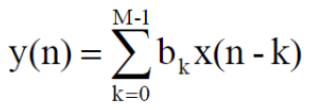

# 21-tap FIR Filter Design

## Table of Contents
- [Overview](#overview)
- [Implement Status](#implement-status)
- [File Description](#file-description)
- [Specification](#specification)
- [Method](#method)
- [RTL Waveform](#rtl-waveform)

&nbsp;

## Overview

This project implements a 21-tap Finite Impulse Response (FIR) filter using Verilog HDL. The FIR filter is a fundamental digital signal processing component widely used in applications such as audio processing, communications, and image filtering.
A Finite Impulse Response (FIR) filter is a type of digital filter characterized by its finite-duration impulse response. Unlike IIR (Infinite Impulse Response) filters, FIR filters use only current and past input samples to compute the output, making them inherently stable.
The "21-tap" designation indicates that the filter uses 21 coefficients (or taps) in its computation. This architecture consists of:

- **20 Delay Elements (D)**: Store the previous 20 input samples, creating a delay line
- **21 Multipliers (⊗)**: Multiply each input sample by its corresponding coefficient
- **21 Adders (⊕)**: Sum all weighted samples to produce the final output

  
  
<i>Figure 1: 21-tap FIR Filter Block Diagram</i>

As shown in the architecture diagram, the input signal x flows through a series of delay elements (D blocks). At each tap point, the delayed signal is multiplied by its corresponding coefficient (b₀, b₁, ..., b₂₀), and all products are summed together through the adder chain to produce the output y.

&nbsp;

### Operating Principle

The filter operates through the following mechanism:

1. **Sample Buffering**: At each clock cycle, a new input sample enters the delay line, and the oldest sample is discarded
2. **Weighted Multiplication**: Each of the 21 samples (current + 20 delayed) is multiplied by its corresponding coefficient b[k]
3. **Accumulation**: All 21 products are summed together to produce the current output sample

&nbsp;

### Mathematical Expression

The output y(n) is calculated as:

  

The mathematical formula represents the convolution operation where:
- **y(n)**: Output signal at time n
- **x(n-k)**: Input signal delayed by k samples
- **bₖ**: Filter coefficient for the k-th tap
- **M-1 = 20**: The summation runs from k=0 to k=20, covering all 21 taps

&nbsp;

### Applications

21-tap FIR filters are commonly used in:
- **Audio Processing**: Equalization, noise reduction
- **Communications**: Channel equalization, pulse shaping
- **Biomedical**: ECG/EEG signal filtering
- **Image Processing**: Edge detection, smoothing
- **Instrumentation**: Anti-aliasing filters

&nbsp;

## Implement Status

RTL code completed.

&nbsp;

## File Description

*To be updated*

&nbsp;

## Specification

*To be updated*

&nbsp;

## Method

The design methodology follows a four-step process to ensure optimal filter performance:

### ◆ Step 1: Coefficient Bit-Width Calculation

**Objective**: Determine the required bit width to achieve the target SNR specification through fixed-point quantization.

**Target Specification**: SNR ≥ 50dB

#### Process:
1. Generate random input signal with 50 samples
2. Define ideal FIR filter coefficients using MATLAB's `fir1` function
3. Perform convolution between input signal and filter coefficients
4. Calculate floating-point reference output

#### Bit-Width Analysis:
For different bit widths (L = 5 to 15):
- Quantize coefficients: `b_f = floor(b * 2^L) / 2^L`
- Calculate quantized output through convolution
- Compute SNR: `SNR(L) = 10 * log10(signal_power / noise_power)`

**Result**: 9-bit representation achieves SNR ≈ 56.83dB (>50dB requirement)

### ◆ Step 2: Coefficient Conversion to Binary

Convert the floating-point filter coefficients to 9-bit fixed-point binary representation.

### ◆ Step 3: Verilog Implementation

Implement the FIR filter in Verilog HDL with the 9-bit quantized coefficients from Step 2.

### ◆ Step 4: Verification

Compare three computation methods to validate the Verilog implementation:

1. **MATLAB Direct Computation**: Floating-point calculation
2. **MATLAB Fixed-Point Computation**: Using quantized coefficients
3. **Verilog Simulation Result**: Hardware implementation output

#### Verification Results:
- MATLAB floating-point and fixed-point results match (starting from index 21)
- Verilog simulation output matches MATLAB fixed-point computation
- **Conclusion**: Verilog implementation is functionally correct

**Note**: MATLAB's `conv` function outputs (N+M-1) samples, where the first sample includes only the first input. For a 21-tap filter, valid output starts from sample 21 onwards.

&nbsp;

## RTL Waveform

  

&nbsp;
